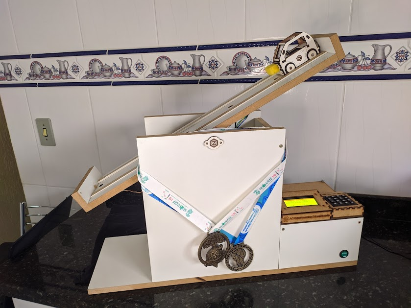

# AUTOMATIZAÇÃO DE EXPERIMENTO EDUCACIONAL
<!-- ENGLISH BELLOW-->

> Equipe obteve 4 premiações nacionais com este projeto, duas na categoria de informática, uma em inovação e outra em ciências da terra e natureza

## 📚 Por que o projeto foi desenvolvido?
Nós sabíamos que experimentos educacionais auxiliam no processo ensino-aprendizagem, visto que
proporcionam aos alunos o desenvolvimento de competências ao aplicarem conceitos teóricos
na resolução de problemas reais. Em contrapartida, a atual realidade evidencia a dificuldade
de implementação desta metodologia devido à falta de recursos. Pensando nisso, demos inicio ao desenvolvimento
de um experimento educacional automatizado e de baixo custo.
## 🚀 Objetivos
Desenvolver um experimento educacional automatizado para ajudar estudantes de ensino médio a compreender a física na prática

- [x] Validar um experimento educacional com alto nível de automação
- [x] Alta confiabilidade e multifuncional
- [x] Baixo Custo
- [x] Imprimir com impressora 3D um redutor de engrenagens
- [x] Funcionamento completo
- [x] Aplicativo mobile funcional
- [ ] Applicativo mobile utilizando React Native

## Como funciona?
   Para o manuseio do protótipo há duas opções primárias, o controle pelo próprio
experimento ou a interação pelo aplicativo desenvolvido para android. Em ambos métodos é
possível que haja plena utilização do experimento. Em se tratando do controle feito
diretamente no protótipo, é necessário mencionar a presença de um teclado matricial e um
display lcd, por meio dos quais o usuário consegue inserir dados e visualizar tudo aquilo que é
relevante para o experimento em uso. 

   Em contrapartida, quando o usuário deseja controlar o experimento pelo celular, toda a
simulação será configurada e exibida no dispositivo móvel. Sendo assim, foi feito no
aplicativo uma interface fácil de ser compreendida, na qual o usuário insere os dados pedidos
e, depois que o experimento é feito, ele consegue visualizar todos os fenômenos explorados.
Além do manuseio do experimento pelo aplicativo, há a possibilidade de realização de
exercícios pela própria aplicação

Veja o vídeo mostrando o funcionamento do protótipo e algumas etapas de desenvolvimento:

## ⚙ ASPECTOS TÉCNICOS
### Programação
- Pouco mais de 1000 linhas de código;
- Programação para o uso de três experimentos em um só modelo;
- Integração bluetooth e sistema embarcado.

### Eletrônica
Alguma das coisas utilizadas:
- Placa de circuito impressa (PCI);
- 6 sensores ópticos;
- Motor de passo NEMA 17 e driver A4988 para o controle
- Arduino Mega;
- Módulo bluetooth HC05.

### Mecânica
- Sistema todo projetado no software SolidWorks;
- Redutor de engrenagens impresso em impressora 3D;
- Eixo para movimentação do plano usinado;
- Móvel para deslocamento (O carrinho da foto) cortado em máquina CNC laser;
- Estrutura principal feita em MDF.

## 👨🏽‍💻 Contribuidores
Todos atuaram em todas as partes do projeto, entretanto, cada área teve um representante específico.
- Pedro Eduardo dos Santos - Programação e liderança
- Matheus Coelho Soares - Projetista mecânico
- Pedro Henrique Nunes - Projetista eletrônico
- Leonardo Pereira Aguiar - Projetista mecânico
